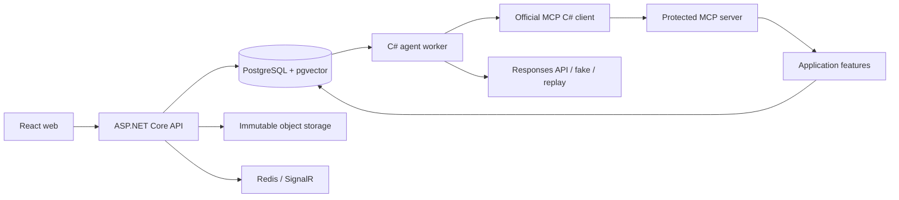

# Architecture

Milestone 1 adds ASP.NET Core Identity, organization memberships and claim-scoped EF access. The account UI consumes the generated OpenAPI client. ADR 0015 describes cookie/tenant boundaries and offline SQLite integration tests; Npgsql remains the runtime provider.

ExpenseGuard is a modular monolith with four independently hosted processes. Shared domain rules do not depend on persistence, HTTP, MCP, or an LLM SDK.

## Dependency rules

- Domain has no external project or package dependencies.
- Application references Domain and defines feature contracts; never EF entities in wire DTOs.
- Infrastructure implements Application ports using EF Core/Npgsql and external adapters.
- Agent depends on the MCP client, not business application services or Infrastructure.
- Worker hosts Agent and the MCP client; durable job persistence will have a narrow worker-owned adapter, separate from business tool handlers.
- MCP server composes Application/Infrastructure and owns all protocol authorization, validation, limits, and safe result shaping.
- API owns human workflows, Identity, authorization and antiforgery.
- ServiceDefaults is shared host plumbing for telemetry and dependency health. It contains no expense business operations.

Milestone 0 only exposes health and a development-only system summary. No expense or user data is available. No database migration is fabricated before an actual entity schema exists. Subsequent milestones commit deterministic EF migrations and a separately run migration job; application hosts do not migrate production databases on startup.

## Persistence and seeds

PostgreSQL is authoritative. Redis is non-authoritative. Object originals will be content-addressed and immutable. Every tenant-owned entity includes an organization key; authenticated scope and object authorization precede access. Seeds will use stable synthetic IDs and explicit versions, run idempotently only in Development/Test with an explicit opt-in, and fail at startup if enabled elsewhere.

Northstar Labs seeds will include four role accounts, the travel/meals policy, synthetic exchange rates, hotel/minibar evidence, a restaurant receipt missing attendees, and duplicate taxi evidence. No employee accounts or sample financial outcomes are claimed before the relevant milestones. See [SEED_DATA.md](SEED_DATA.md).
